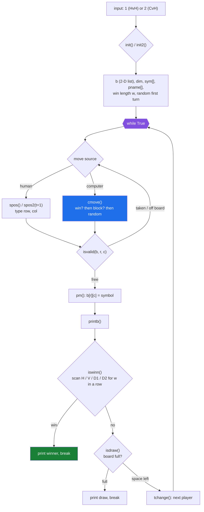
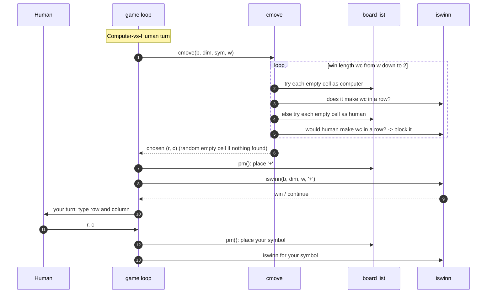

# Gomoku (Python)


**A terminal Gomoku (five-in-a-row) game. The board size, the number of players,
and the win length are all chosen at startup, so it plays anything from classic
15×15 five-in-a-row to a quick 3×3 tic-tac-toe. Play human-vs-human or against a
simple computer opponent.**

A short, dependency-free script written for a programming course — the whole
game is one file of plain functions and a 2-D list for the board.

---

## Modes

At launch you pick one:

| Input | Mode | Notes |
|---|---|---|
| `1` | **Human vs Human** | Asks for a board dimension, a player count, and a win length, then each player's name and single-character symbol |
| `2` | **Computer vs Human** | Board dimension and win length only. The computer is Player 1 with symbol `+` |

The starting player is chosen at random.

## How to Play

- On your turn, enter a **row** and a **column** (both 1-based).
- The move is rejected and re-asked if the cell is taken or off the board.
- First player to line up `win length` of their symbol horizontally,
  vertically, or diagonally wins. If the board fills with no winner, it's a
  draw.

## The Computer Opponent

The `cmove` search is greedy and one move deep:

1. For each win length from the target down to 2, scan every empty cell —
   if placing the computer's symbol there makes a line, play it.
2. Otherwise, if the **opponent** could make that line next turn, block it.
3. If neither applies, play a random empty cell.

It has no lookahead beyond that, so it is beatable with a simple fork.

## Architecture

One script, no classes. The board is a 2-D list `b`; everything else is a plain
function that takes it and the current parameters. The menu picks one of two
setup functions and one of two move sources, then a single loop drives the game.





## Requirements

- Python 3.6+ (uses f-strings). No third-party packages.

## Run

```bash
git clone https://github.com/Husnaiin/Board-Game-Gomuko-Python-.git
cd Board-Game-Gomuko-Python-
python src/gomuko_HvH_CvH.py
```

Example session:

```text
For H v H press 1, For C v H press 2: 2
Dim:15
Win Count:5
Enter your name: Alice
Enter your symbol: O
```

## Project Structure

```text
Board-Game-Gomuko-Python-/
├── src/
│   └── gomuko_HvH_CvH.py   the whole game
├── LICENSE
└── README.md
```

## Notes and Known Limitations

- **Input is not validated for type.** Entering a non-number at a prompt raises
  a `ValueError` and ends the game.
- The board is allocated as `(dim + 1) × (dim + 1)` but only `dim × dim` is
  used and printed — a harmless extra row/column.
- Win detection scans from every cell without clamping, so it relies on the
  unused border cells never matching a real symbol.
- In Human-vs-Human mode with 3+ players, the random first-turn pick never
  selects the last player (`randint(0, nop-1)` is fine here; the C++ port has
  the off-by-one, this one does not).
- No undo, no save, no AI difficulty setting.

## License

[MIT](LICENSE) © 2023 Husnain Ahmad
